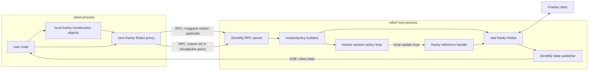

# zero-franky

Use `franky` from a non-realtime machine through a ZeroMQ protocol.



## Usage

`zero-franky` keeps the client-side construction style familiar:

```python
from zero_franky import setup_zero_franky
from zero_franky import Robot
from franky import Affine, CartesianMotion, ReferenceType

setup_zero_franky("server-ip", 18812)

robot = Robot("192.168.100.1")
motion = CartesianMotion(Affine([0.2, 0.0, 0.0]), ReferenceType.Relative)
robot.move(motion, asynchronous=True)
robot.join_motion()
```

`Robot` is a proxy, and real local `franky` objects like `Affine`, `CartesianMotion`, and `JointMotion` are encoded into plain msgpack payloads. The server reconstructs corresponding real `franky` objects next to the robot.

## Server

On the robot host:

```bash
zero-franky-server
```

By default this binds RPC on `tcp://0.0.0.0:18812`, state PUB on `tcp://0.0.0.0:18813`, and tracker updates on `tcp://0.0.0.0:18814`.

Common overrides:

```bash
zero-franky-server --host 192.168.1.20 --port 18812
zero-franky-server --port 19000 --no-pub
```

The equivalent Python entry point is:

```python
from zero_franky.zmq_server import ZmqRobotServer

ZmqRobotServer(
    bind="tcp://0.0.0.0:18812",
    pub_bind="tcp://0.0.0.0:18813",
    tracker_bind="tcp://0.0.0.0:18814",
).serve_forever()
```

## Implemented protocol

- `robot.create`
- `robot.recover_from_errors`
- `robot.move`
- `robot.join_motion`
- `robot.poll_motion`
- `robot.stop`
- `robot.get_last_teleop_state`
- `robot.start_joint_tracker`
- `robot.start_cartesian_tracker`
- `tracker.status`
- `tracker.stop`
- `tracker.set_joint_reference`
- `tracker.set_cartesian_reference`

Supported motion payloads cover position, velocity, waypoint, stop, and fixed impedance motions. Tracker motions are exposed through tracker sessions rather than serialized as ordinary motion objects.

## Telemetry

When the server has a `pub_bind`, `RobotManager` registers a motion callback and publishes snapshots on `robot.state`.

```python
setup_zero_franky("server-ip", 18812)
subscriber = robot.state_subscriber()
topic, state = subscriber.recv()
```

## Tracker Sessions

Tracker sessions are for `JointImpedanceTrackingMotion` and `CartesianImpedanceTrackingMotion`. They keep the impedance motion and reference handle on the robot host. By default, client code sets references through the returned proxy:

```python
with robot.start_joint_impedance_session(stiffness=[10.0] * 7, damping=[6.0] * 7) as session:
    session.set_joint_reference(q, velocity=dq)
```

The proxy stops the tracker when the context block exits.

A session can also run a Python policy loop beside the reference handle. This avoids trying to servo over ZeroMQ while still letting client code define the policy.

There are two policy transports:

- `import`: send `module` + `qualname`; the server imports the policy. Use this for stable policies installed on the robot host.
- `cloudpickle`: serialize the function and send it over RPC. Use this for exploratory work on a trusted control network.

The built-in hold policies are importable:

```python
from zero_franky.tracker_policies import hold_current_joint

with robot.start_joint_impedance_session(
    hold_current_joint,
    stiffness=[10.0] * 7,
    damping=[6.0] * 7,
) as session:
    status = session.status()
```

Or it can be shipped with `cloudpickle` for exploratory work:

```python
import math


def wiggle_joints(context):
    q = list(context.robot.current_joint_positions)
    amplitude = 0.03
    frequency = 0.25
    phase_offsets = [index * math.pi / 7.0 for index in range(7)]

    def step(context):
        omega = 2.0 * math.pi * frequency
        position = [
            q_i + amplitude * math.sin(omega * context.elapsed + phase)
            for q_i, phase in zip(q, phase_offsets)
        ]
        velocity = [
            amplitude * omega * math.cos(omega * context.elapsed + phase)
            for phase in phase_offsets
        ]
        return {"position": position, "velocity": velocity}

    return step

with robot.start_joint_impedance_session(
    wiggle_joints,
    policy_transport="cloudpickle",
    stiffness=[10.0] * 7,
) as session:
    status = session.status()
```

`cloudpickle` policy transport executes client-provided Python on the robot host. Use it only on a trusted control network.

Cartesian sessions use the same policy shape and return an `Affine` target:

```python
from zero_franky.tracker_policies import hold_current_cartesian

with robot.start_cartesian_impedance_session(
    hold_current_cartesian,
    translational_stiffness=250.0,
    rotational_stiffness=25.0,
) as session:
    status = session.status()
```

The policy function receives a context with `franky`, `robot`, `elapsed`, `iterations`, and `stop()`. A factory may return a step function, or the policy may act directly as the step function. Joint steps return `{"position": q, "velocity": dq, "torque_feedforward": tau}`. Cartesian steps return `{"target": affine, "target_twist": twist}`.

